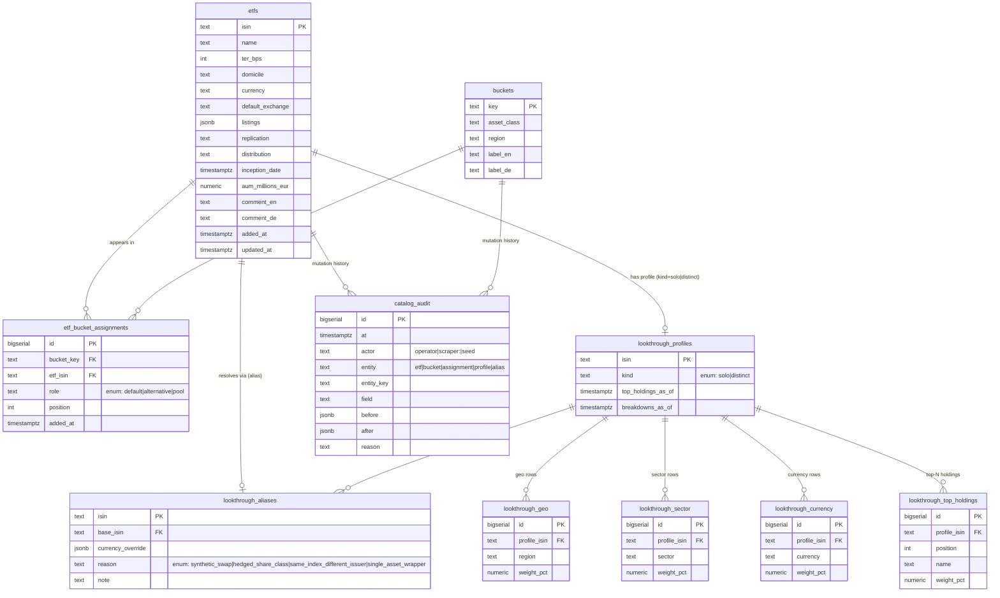

# DB Migration — Overview

> **Status:** Planning. No code changes have landed yet. This doc is the
> shared map of where we're going; the per-phase plans live alongside it
> and are linked from the bottom of this file.
>
> **Companion docs:**
> - `DOCUMENTATION.md` — current functional / engine logic.
> - `ETF_DATA_CONTROL.md` — current data-as-code refresh + admin contract.
> - `.local/tasks/db-migration-phase[1-5]-*.md` — the five executable
>   per-phase plans.

Last updated: 2026-05

---

## 1. Why we're doing this

The Investment Decision Lab is currently a **frontend-only** app whose
catalog and look-through data live as TypeScript literals in source
files (`src/lib/etfs.ts`, `src/lib/lookthrough.ts`) plus two
`*.overrides.json` files refreshed by the scrapers. The admin pane
mutates these files via either GitHub PRs or direct workspace writes;
either way, **the source repository is the database**.

That worked while the catalog was tiny and edits were rare. With the
popular-ETF bulk import, the bucket-pool slot, the instruments-vs-buckets
split, the look-through alias substitution table, the per-bucket pool
cap, and the strict global ISIN uniqueness invariant, the data layer
has outgrown the "edit a `.ts` file and open a PR" model:

- **Concurrency / merge pain.** Operator edits in the workspace and
  scraper commits on `main` constantly diverge on the same files; the
  `bin/sync-with-main.sh` workflow exists only to paper over this.
- **No real audit trail.** Who changed what, when, and why is split
  across git history, `refresh-changes.log.jsonl`, and
  `refresh-runs.log.md`. Cross-referencing a single ISIN's history
  requires manual archaeology.
- **Constraint enforcement is in code, not data.** Strict ISIN
  uniqueness, pool caps, alias-no-chain — all enforced by
  `validateCatalog()` running at module load, easy to drift from.
- **Two write paths to maintain.** The same mutation has a PR
  implementation (production) and a direct-write implementation
  (workspace), each parsing/regenerating `etfs.ts` text. This is
  fragile and doubles the surface area of every catalog feature.
- **No path to multi-user / per-user portfolios.** Anything that
  needs per-user state is blocked because there is no DB to put it
  in.

The migration moves the catalog and look-through data into the
existing Replit-Postgres + Drizzle stack already used by `lib/db`,
with the api-server reading via in-memory snapshots so the
synchronous engine on the frontend stays unchanged.

## 2. Done state — what the world looks like after Phase 5

- Postgres holds the canonical catalog: `etfs`,
  `etf_bucket_assignments` (with `role ∈ {default, alternative, pool}`
  and a partial unique index enforcing strict global ISIN
  uniqueness), `lookthrough_profiles`, `lookthrough_aliases`,
  `lookthrough_geo / sector / currency / top_holdings`, and an
  append-only `catalog_audit` log.
- The admin pane writes directly to the DB inside transactions that
  also append to `catalog_audit`. There is no PR flow, no
  `directWriteMode()` bifurcation, no `bin/sync-with-main.sh`, no
  GitHub-mutation env vars (`GITHUB_PAT` / `GITHUB_OWNER` /
  `GITHUB_REPO`).
- The scrapers (`refresh-justetf`, `refresh-lookthrough`,
  `backfill-comments`, `scrape-popular-etfs-*`) write directly to
  the DB and to `catalog_audit`. The `*.overrides.json` files and
  `refresh-changes.log.jsonl` are gone; `refresh-runs.log.md` stays
  as a human-readable run log.
- `INSTRUMENTS`, `BUCKETS`, `PROFILES`, `SHARED_BASKET_PROFILES`,
  `DISTINCT_PROFILES`, `HEDGED_ISINS` — all the giant in-source
  literals — are deleted. `etfs.ts` and `lookthrough.ts` shrink to
  types, loader calls, and pure helpers.
- The whole test suite (engine, components, e2e) runs against a
  seeded test database via a single fixture snapshot.
- The Methodology page, `DOCUMENTATION.md`, `ETF_DATA_CONTROL.md`,
  and `replit.md` describe the DB-backed system; the migration
  itself survives only as Changelog entries.

## 3. Proposed data model

Key invariants enforced at the DB layer (not in app code):

- **Strict global ISIN uniqueness** across `etf_bucket_assignments`
  via a partial unique index on `etf_isin` — every ISIN appears in
  at most one (bucket, role) slot.
- **Pool cap** of `MAX_POOL_PER_BUCKET = 50` per bucket — either as
  a CHECK against a counted view or enforced by the shared write
  helper used by both admin routes and scrapers.
- **No alias chains** — a CHECK plus trigger ensures
  `lookthrough_aliases.isin <> base_isin` AND `base_isin` itself
  may not appear in `lookthrough_aliases.isin`.
- **Audit-with-mutation atomicity** — every mutation is in the same
  transaction as its `catalog_audit` insert, so a successful audit
  row is equivalent to a successful mutation (no drift possible).

## 4. Look-through resolution rule

Today the look-through layer has a subtle three-source merge:
curated `PROFILES`, scraped overrides in
`lookthrough.overrides.json`, and the `SHARED_BASKET_PROFILES` /
`variantOf(...)` substitution map (an alias from a "variant" ISIN —
e.g. a synthetic swap or hedged share class — to a "base" ISIN that
carries the real profile). The post-migration rule consolidates
this into a single, ordered resolution:

> **For an input ISIN `I`:**
>
> 1. If `I` exists in `lookthrough_aliases`, load the profile of
>    `aliases[I].base_isin` from `lookthrough_profiles` (and its
>    `lookthrough_geo / sector / currency / top_holdings` rows),
>    then merge `aliases[I].currency_override` on top if non-NULL.
> 2. Otherwise, load the profile of `I` directly from
>    `lookthrough_profiles`.
> 3. If neither matches, fall back to `RUNTIME_PROFILES` for
>    transient off-catalog imports (Explain tab manual entries).
>
> **Alias wins over scrape.** Pool / scrape data must never overwrite
> alias-resolved fields — the alias indirection is editorial and
> takes precedence by design. Scrapers that touch a `lookthrough_*`
> table for an ISIN that exists in `lookthrough_aliases` are
> rejected at the write helper level, so this invariant cannot be
> violated by either an operator or a cron job.

The four `reason` values on `lookthrough_aliases` capture *why* the
substitution exists, so the editorial intent is queryable instead of
hidden in code comments:

| `reason` | What it means |
|---|---|
| `synthetic_swap` | The variant tracks the same index via a swap; show the index's underlying. |
| `hedged_share_class` | Same index, different currency hedge; show the unhedged base's holdings with the hedged currency. |
| `same_index_different_issuer` | iShares / Vanguard / SPDR over the same benchmark; show the canonical issuer's holdings. |
| `single_asset_wrapper` | An ETC / ETP wrapping one asset (gold, bitcoin); show the underlying directly. |

## 5. The five phases

The migration is split into five phases. Each one is independently
mergeable, leaves the app fully working, and is documented as its
own task plan.

| Phase | Plan file | One-liner | User-visible? |
|---|---|---|---|
| **1 — Schema + read path** | `.local/tasks/db-migration-phase1-schema-read-path.md` | Land the schema, seed it from today's source literals, switch the api-server's read path to a DB-backed loader behind a `CATALOG_SOURCE=file\|db` flag (default `file`). Source literals stay as fallback. | No — read parity verified by a shadow-compare boot log. |
| **2 — Write path + GitHub apparatus removed** | `.local/tasks/db-migration-phase2-write-path.md` | Replace the 7 PR helpers with DB transactions (each with an audit-row insert), delete `directWriteMode()`, the sync script, the PR-related admin UI, and the GitHub env vars. | Admin operators stop seeing "Pull request opened" toasts; everything else identical. |
| **3 — Scrapers on the DB** | `.local/tasks/db-migration-phase3-scrapers.md` | Switch all four scrape scripts (`refresh-justetf`, `refresh-lookthrough`, `backfill-comments`, `scrape-popular-etfs-*`) to write directly to DB tables + `catalog_audit`. `*.overrides.json` is no longer touched; `refresh-changes.log.jsonl` is retired in favour of the audit log. | No. |
| **4 — Test suite on the DB** | `.local/tasks/db-migration-phase4-test-suite.md` | Migrate ~537 tests (engine + components + e2e) to seed a `TEST_DATABASE_URL` schema from a JSON fixture snapshot per run. | No. |
| **5 — Production cutover + cleanup** | `.local/tasks/db-migration-phase5-cutover-cleanup.md` | Seed the production DB, flip `CATALOG_SOURCE=db` in production, delete the `INSTRUMENTS / BUCKETS / PROFILES / SHARED_BASKET_PROFILES / DISTINCT_PROFILES / HEDGED_ISINS` literals and the override JSONs, rewrite the Methodology page (DE+EN), and bring all top-level docs to the end state. | Briefly: a 5–10 minute write-stop during the production seed. After that, identical behaviour, much smaller repo. |

## 6. Cross-cutting constraints

These hold across every phase and aren't repeated in the per-phase
plans:

- **Engine stays synchronous.** The frontend portfolio engine is
  pure synchronous TypeScript. The DB-backed loader runs once at
  api-server boot and exposes the same in-memory shape that
  `INSTRUMENTS` / `BUCKETS` / `PROFILES` exposed before. No call
  site in `portfolio.ts`, `lookthrough.ts` consumers, or React
  components becomes async because of this migration.
- **Auth contract unchanged.** All `/api/admin/*` routes stay
  gated by `requireAdmin` (the `ADMIN_TOKEN` bearer check). The
  audit log records the operator behind the token.
- **Single shared write helper.** Both admin routes (Phase 2) and
  scrapers (Phase 3) go through one `applyEtfMutation()` /
  `applyScrapedEtfPatch()` helper that owns the transaction +
  audit-insert + constraint translation. This is the single place
  where catalog mutations happen, post-migration.
- **DB is single-point-of-failure for catalog reads.** The Phase 1
  `CATALOG_SOURCE=file` fallback is kept as a disaster-recovery
  switch in Phase 5 even though the literals are gone — it would
  produce an empty catalog and a loud error, which is the right
  signal during an outage. This is documented in
  `ETF_DATA_CONTROL.md` post-Phase-5 along with a backup/restore
  recommendation.

## 7. Migration order and why

Read-before-write (Phase 1 before Phase 2) is mandatory: we need a
proven-correct DB read path before we can stop writing to the
source literals. Write-before-scrapers (Phase 2 before Phase 3)
keeps the pull-request apparatus functional while operators rely
on it; once Phase 2 lands, scraper writes are the only remaining
consumer of the override JSONs, so Phase 3 cleanly retires them.
Tests-before-cutover (Phase 4 before Phase 5) means the test suite
is already DB-backed when we delete the literals it used to import
from — otherwise Phase 5 would simultaneously break and rewrite the
test suite, which is the worst possible cocktail.

The only phase that requires an explicit operator window is
Phase 5's production seed. Phases 1–4 are code-only and can ship
behind feature flags during normal operations.

## 8. Per-phase plan files

The full step-by-step plans, including file lists, acceptance
criteria, and architecture constraints, live next to this overview
in `.local/tasks/`:

- `.local/tasks/db-migration-phase1-schema-read-path.md`
- `.local/tasks/db-migration-phase2-write-path.md`
- `.local/tasks/db-migration-phase3-scrapers.md`
- `.local/tasks/db-migration-phase4-test-suite.md`
- `.local/tasks/db-migration-phase5-cutover-cleanup.md`

When a phase is picked up, the executing agent should treat the
matching plan file as authoritative — this overview is a map, not a
spec.
